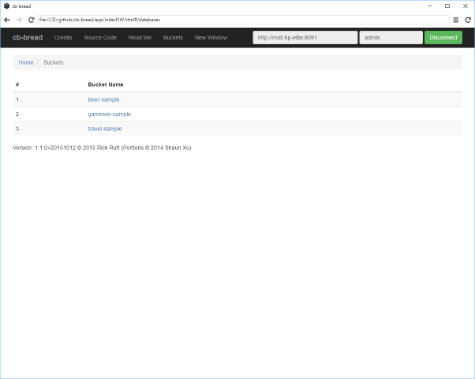
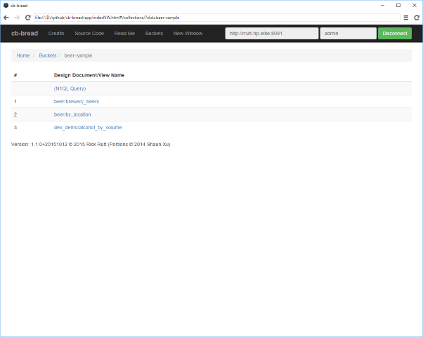
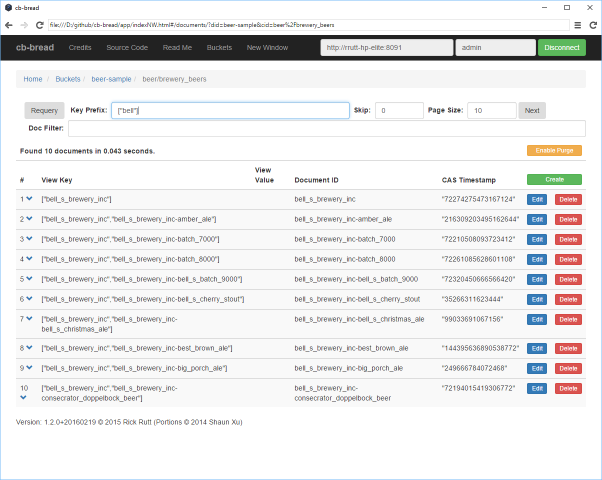
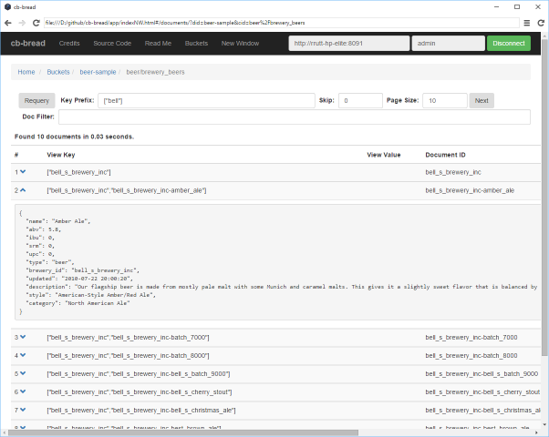
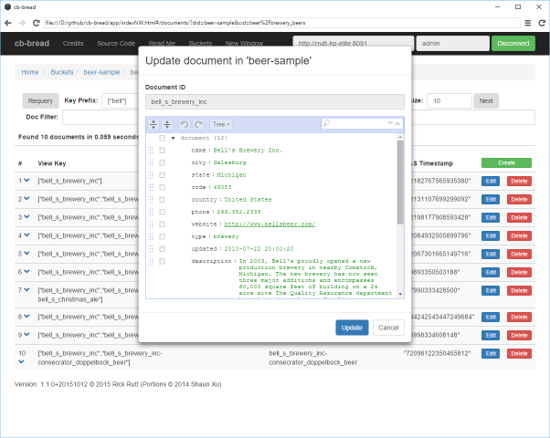
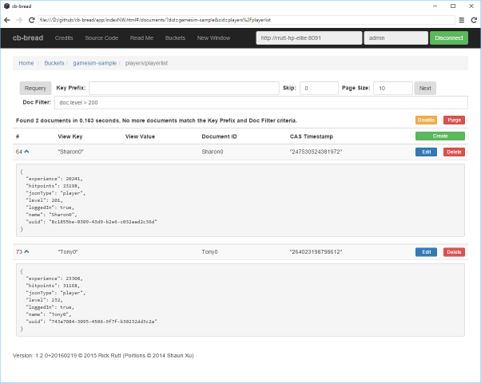
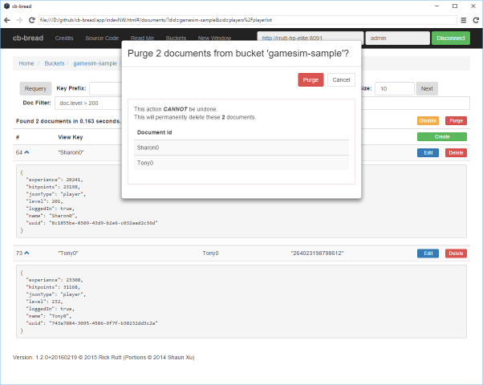
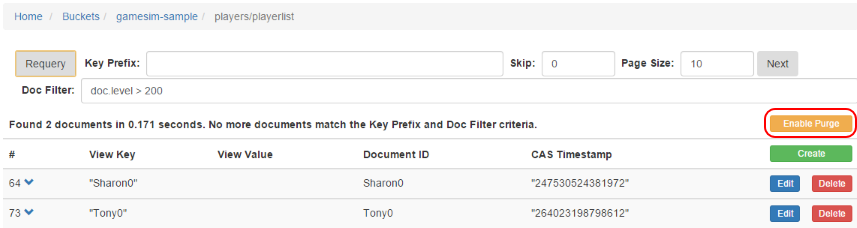
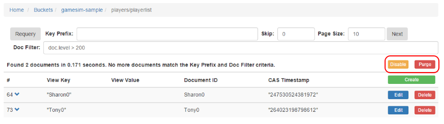
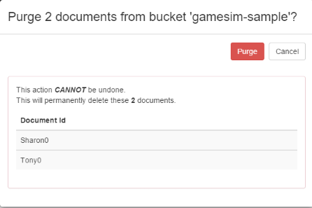

# cb-bread

Couchbase Browse/Read/Edit/Add/Delete

This application provides a (hopefully) friendly user interface for, querying, browsing, and editing JSON documents stored in a [Couchbase](http://www.couchbase.com/) NoSQL document database server.
The acronym BREAD replaces the usual CRUD = Create/Read/Update/Delete purely for aesthetic reasons.

This application is intended to be run on your local workstation, so you can provide Couchbase server connection options on the command line and monitor the server log messages.
Running the application on your own workstation also relieves the application of some security responsibilities.

There are two options for running the application:

- Run as an HTTP server using [Node.js](https://nodejs.org/), and then open the application web page in a web browser.

- Run as a standalone desktop application with an embedded browser window using [NW.js](http://nwjs.io/).

This application can connect to any Couchbase server visible to your workstation's network connection.

The application supports filtering documents using a _Key Prefix_ for any Couchbase view defined on a bucket. (For Map/Reduce views, the _reduce_ operation is omitted from the query.)

The application also supports additional document filtering using a JavaScript expression.

I wrote a blog article about my experience creating this application: [If You Build It, They Will Fork It](https://rickrutt.wordpress.com/2015/02/15/if-you-build-it-they-will-fork-it/).

**_Added in Release 1.1.0_**: When used to query against Couchbase version 4, you can also perform N1QL (pronounced "nickel") queries against any bucket that has at least a primary key Global Secondary Index (GSI) defined.
Note that results from a N1QL query are treated as _read-only_ and do _not_ support editing or purging from within **cb-bread**.
However, as of Couchbase 4.1, the N1QL language supports Select, Insert, Update, and Delete statements:
[What's new in Couchbase Server 4.1](http://developer.couchbase.com/documentation/server/4.1/introduction/whats-new.html)

**_Added in Release 1.2.0_**: The application allows purging the documents displayed on the current results page from a view query, as filtered by the optional **Doc Filter** JavaScript expression.

**_Release 1.2.5_**: Has been tested on Windows 7 and Windows 10 using Node.js version 8 and the pre-compiled binary for the Couchbase NPM module.  This release has also been tested on Windows using Node.js version 10.10.0 with a Visual Studio compiler environment installed.

### Screen Shots

Bucket List:

View List:

Document List:

Expanded JSON Document:

JSON Document Editor:

JSON Document Editor (Text Mode):

")

Filtered Document List with Purge Enabled:

Purge Confirmation:

### Pre-requisites:

You need **Node.js**: [Node.js downloads](http://nodejs.org/download/).

In order to let the Node/npm installer compile the Couchbase Node SDK, you need **Python 2.7.x** (where "x" is any point release): [Download Python](https://www.python.org/downloads/)

If you want to customize the **cb-bread** application, you need a command-line based Git source code control client: [Git client downloads](http://git-scm.com/downloads).
Windows users may prefer [PortableGit](https://github.com/msysgit/msysgit/releases/).

#### _Note for Mac OSX:_

You also need to have [Xcode](https://developer.apple.com/xcode/downloads/) installed.

#### _Notes for Windows:_ 

If you want to run **cb-bread** as an HTTP server via Node.js version 8, you can omit the installation of Python since the **Couchbase SDK for Node** NPM module includes a pre-compiled binary for Windows; in that case simply run **npm install**.

If you choose to omit Python and use the pre-compiled binary, you will _not_ be able to run **cb-bread** as a standalone desktop application;
instead you will need to run it as an HTTP server using Node.js version 8.  **_Exception:_** A pre-built installation of the **cb-bread** standalone application compatible with Node.js version 12 is available in this GitHub repository as a 7-Zip archive file **bin\\cb-bread-nwjs-Windows7.7z**

### To download cb-bread without Git:

Open a web browser to the [rrutt / cb-bread releases](https://github.com/rrutt/cb-bread/releases) page on GitHub.com

For the desired release tag (the newest is shown first), download the **zip** or **tar.gz** archive file link to your workstation.

Expand the downloaded archive file, open a command prompt or terminal window, and navigate to the root folder of the expanded archive contents.

### To download cb-bread using Git:

For Windows, open a **git-bash** command prompt window, which provides Unix/Linux bash shell command support.
For Mac OSX or Linux, open a terminal window. 

Navigate to your _home_ folder (or a folder of your choice where you store Git project workspace folders).

Clone the **cb-bread** project from GitHub, and then navigate to that folder:

    cd ~
    git clone https://github.com/rrutt/cb-bread.git
    cd cb-bread

## Installing and Running cb-bread as an HTTP Server:

### To install cb-bread for use as an HTTP server:

    npm install

### To run cb-bread as an HTTP server:

    node server

Then open [http://localhost:8008/](http://localhost:8008/) in a browser.

**_Note:_** If the browser window seems to _hang_ after some operation check the command prompt window for possible error messages.

### To stop the cb-bread HTTP server:

Use **Control-C** once or twice in the command prompt window to stop the Node.js server.

### For command-line options:

    node server --help

You can also view the resulting usage text as [help.txt](https://github.com/rrutt/cb-bread/blob/dev/help.txt)

## Installing and Running cb-bread as a Standalone Application

The **cb-bread** application incorporates [NW.js](http://nwjs.io/) technology to allow running cb-bread as a standalone desktop application.
The **NW.js** module (previously known as **node-webkit**) includes an embedded **webkit** browser based on Chromium (Google Chrome).

Third-party **npm** modules that include compiled binary components must be recompiled for compatibility with the _binding_ interface used by **NW.js**.

### Pre-requisites:

In order to let the installation script rebind the Couchbase Node SDK binary modules, you _must_ have Python 2.7.x (where "x" is any point release): [Download Python](https://www.python.org/downloads/).

You must also be using Node.js version 10. This release has been tested on Windows 7 and Windows 10 using Node.js version 10.10.0

### _Notes for Windows:_

You will need to add **C:\Python27** to your **PATH** variable, and possibly logout and login again for this change to take effect.

Review this Stack Overflow answer:
[...install node modules that require compilation on Windows...](http://stackoverflow.com/questions/14278417/cannot-install-node-modules-that-require-compilation-on-windows-7-x64-vs2012/15830975#15830975).

After reviewing that question and answer, follow the four steps described in this wiki page referenced in the Stack Overflow answer:
[TooTallNate/node-gyp: Visual Studio 2010 Setup](https://github.com/TooTallNate/node-gyp/wiki/Visual-Studio-2010-Setup).

Then run this command to test the ability to compile the Couchbase SDK modules:

    npm install

(You may need to run this command in the **Windows SDK 7.1 Command Prompt** terminal window.)

### Installation

Run either of the following scripts to perform the full installation for use with **NW.js**.
This includes installing the **NW.js** launcher appropriate for your operating system, and rebinding the Couchbase SDK binary modules for compatibility with **NW.js** and the **nw-gyp** binary module binding component.

_Note:_ After running either of these scripts, the **cb-bread** application still remains compatible with standard **Node.js** and the normal **node server** launch option as an HTTP server.

#### _On Windows:_

    install.bat

You can run this file in a command prompt terminal or double-click on this file in File Explorer.
(You may need to run this command in the **Windows SDK 7.1 Command Prompt** terminal window.)

Once you use the **install.bat** script to install as a Standalone Application, **cb-bread** may no longer run as an HTTP server using **node server**.

You can revert to HTTP server operation using these commands:

    rm -rf node_modules
    npm install
    node server

##### Pre-built standalone installation for Windows and Node.js version 0.12

If you have no Visual Studio compiler environment installed, a pre-built installation of the **cb-bread** standalone application is available as the **bin\cb-bread-nwjs-Windows7.7z** file within this Git workspace.

Expand this archive file using 7-Zip, which can be downloaded from **<https://www.7-zip.org/>** 

This pre-built installation of cb-bread runs with **Node.js 0.12**, but might also run with newer versions of Node.js

#### _On Linux or Mac OSX:_

    bash ./install.sh

You may need to prefix this command with **sudo**: 

    sudo bash ./install.sh

(This script can also be run on Windows inside a **git-bash** terminal session.)

If any or all of these setups fail, you should still be able to run  **cb-bread** as an HTTP server via the **node server** command described above, using pre-compiled binaries.
In that case simply run **npm install** and ignore any compiler errors for the **couchbase** module.

Once you use the **install.sh** script to install as a Standalone Application, **cb-bread** may no longer run as an HTTP server using **node server**.

You can revert to HTTP server operation using these commands:

    rm -rf ./node_modules
    npm install
    node server

### Launching as a Standalone Application

#### _On Windows:_

Run this script, either in a command prompt terminal or by double-clicking it in File Explorer:

    cb-bread.bat

#### _On Linux or Mac OSX:_

Open a terminal window and run the following command:

    bash ./cb-bread.sh

This script can also be run on Windows inside a **git-bash** terminal session.

### Passing Optional Command Line Arguments:

Pass any optional arguments (as documented in the **help.txt** file or the **node server --help** command) after the script name.

For example:

    cb-bread.bat --host localhost --user admin

or:

    bash ./cb-bread.sh --host localhost --user admin

### Viewing Log Messages in Standalone Mode

Log messages will _not_ appear in the terminal window (except perhaps in Mac OSX).

Instead, they will appear in the webkit Developer Tools JavaScript console.
This can be opened by clicking on the **≡** icon in the upper-right corner of the **cb-bread** window.
(On Mac OSX, the **≡** icon is replaced by a _gear_ icon.)

### For command-line options:

Use the same command as for HTTP server mode:

    node server --help

or let the script invoke that for you:

    bash ./cb-bread.sh --help

    cb-bread.bat --help

You can also view the resulting usage text as [help.txt](https://github.com/rrutt/cb-bread/blob/dev/help.txt)

## Querying and Filtering JSON Documents with the cb-bread Application

For these examples, I am running **cb-bread** against a local Couchbase Server installed on my workstation with the **beer-sample** and **gamesim-sample** buckets created and loaded with the Couchbase-provided sample data.
See the following section for installation instructions for your workstation.

### Starting the HTTP server:

In order to avoid entering the host, user, and password in the web page login fields, start the demonstration by passing these values on the command line:

    node server -h localhost -u admin -p demo01

Then open a browser to **[http://localhost:8008/](http://localhost:8008/)**

### Starting the standalone desktop application:

In order to avoid entering the host, user, and password in the web page login fields, start the demonstration by passing these values on the command line:

    bash ./cb-bread.sh -h localhost -u admin -p demo01

or 

    cb-bread.bat -h localhost -u admin -p demo01

The embedded browser window will open.

### Browsing documents in a view:

With the login credentials already provided, simply click the **Connect** button on the home page

On the **Home / Buckets** page, click the **gamesim-sample** bucket.

On the **Home / Buckets / gamesim-sample** page, click the **players/playerlist** view.
The first 10 documents from that view appear in the **Home /  Buckets / gamesim-sample / players/playerlist** document list page.

Click the **v** symbol next to a document line to expand the document text for review.

Click the **^** symbol to collapse the document text.

### Editing a document:

Click the **Edit** button to the right of a document line to open a JSON outline editor.

In the JSON outline editor, click the **Tree▼** control to change to a JSON text editor.
Click **Text▼** to change back to the outline tree editor.

You can practice using the JSON outline editor at this web page: [JSON Editor Online](https://www.jsoneditoronline.org/).
Documentation for the outline editor is available at [JSON Editor Online - Documentation](https://www.jsoneditoronline.org/doc/index.html).

Make any changes to the JSON document and click **Update**, or else click **Cancel** to close the JSON editor.

### Adding a new document:

On the document list page, click the **Create** button at the right side of the table header.

The JSON outline editor appears with an empty document.
The editor can be toggled between **Tree** and **Text** mode.

To finish creating the document, enter a value into the **Document ID** text field at the top of the editor, then click the **Create** button.
Otherwise, click **Cancel**.

### Deleting a document:

Click the **Delete** button to the right of a document line to open a JSON text view.

To confirm deletion of the document, retype the Document ID in the **Confirmation Document ID** text field and click the **Delete** button.
Otherwise click **Cancel**.

### Querying for a specific view key:

Type the text **Tony1** in the **Key Prefix** query field in the document list page and press the keyboard Enter key (or click **Requery**).
Note that no surrounding quotes should be typed.

The following single document appears:

    {
      "experience": 321,
      "hitpoints": 10,
      "jsonType": "player",
      "level": 2,
      "loggedIn": true,
      "name": "Tony1",
      "uuid": "4ba1879c-9574-4d3d-892c-bcebcec63e49"
    }

### Querying for documents sharing a view key prefix:

Type the text **Tony** in the **Key Prefix** query field and press Enter.

Several documents appear.

### Paging through additional documents:

Type the single letter **B** into the **Key Prefix** query field, and change the **Page Size** to **5**.
Press the Enter key or click **Requery**.

Five documents appear.
Click **Next** to see more results.

Click **Next** again.
If no more results are available, the document list appears empty.

Click **Prev** to see the previous page.

At any time while paging, click **Requery** to return to the first page of document results.

### Reversing the sort order.

Place a minus sign in front of the **Page Size** value and press Enter (or click **Requery**).

The resulting documents appear in descending view key order.

### Querying compound array-valued view keys:

Click the **Buckets** link in the top tool-bar or in the _breadcrumb_ line.

Click the **beer-sample** bucket name.

Click the **beer/brewery_beers** view.
The first 10 brewery and brewery/beer documents appear.

Type the exact text **["atwater\_block\_brewing"]** into the **Key Prefix** query field, including the square brackets and full quotes (_not_ apostrophes), then press Enter or click **Requery**.

The brewery document for Atwater Block Brewing in Detroit appears, followed by documents for its selection of beers.

You can also enter a partial prefix value, such as **["bell"]**.
This returns results for Bell's Brewery Inc. and its beers, followed by Bellows Brew Crew and its beers.

You can enter a compound array **Key Prefix** such as **["bell\_s\_brewery\_inc","bell\_s\_brewery\_inc-batch"]** to restrict the query to items with that pattern at the start of their view key.
This query returns two Bell's beers "Batch 7000" and "Batch 8000".

### Querying numeric view keys:

To enter a numeric exact view key value in the **Key Prefix** field, precede it with an equals sign.

To demonstrate this, I created a development view named **dev_demo/alcohol_by_volume** against the **beer-sample** bucket:

    function (doc, meta) {
      if (doc.abv) {
        emit(doc.abv, doc.style);
      }
    }

When I query this with **Key Prefix** set to **=0.5** it returns this single non-alcoholic beverage:

    {
      "name": "Birell",
      "abv": 0.5,
      "ibu": 0,
      "srm": 0,
      "upc": 0,
      "type": "beer",
      "brewery_id": "coopers_brewery",
      "updated": "2010-07-22 20:00:20",
      "description": "Birell has all the hallmarks of a great premium beer, rich colour, full malty flavour and the ability to quench a thirst, with one important difference - virtually no alcohol. \r\n\r\nBrewed under license in Australia by Coopers, Birell is made using only the finest Australian malted barley, hops and yeast, with no artificial additives or preservatives.\r\n\r\nCoopers Birell may be found in most supermarkets (375ml bottles or cans).",
      "style": "American-Style Light Lager",
      "category": "North American Lager"
    }

Querying this view with **Key Prefix** set to **=3.2** returns 4 beers with 3.2% alcohol content, and one beer with 3.22% alcohol.

Querying this view with **Key Prefix** set to **=3.22** returns just the one beer with 3.22% alcohol content.

### Advanced querying with Doc Filter expressions:

For these examples navigate to the **Home  / Buckets / beer-sample / beer/brewery_beers** document list page.

The **Doc Filter** accepts JavaScript expressions and filters the document listing results based on the _truthyness_ of the expression value.
If the expression returns null, undefined, 0, or false for a given document, that document is _excluded_ from the query results.

A document is also excluded if the expression throws a _null-reference exception_.
This means there is no need to _null protect_ any **object.property.subproperty** references in the expression; if the **object.property** does not exist the entire expression is treated as _false_ and that document is excluded from the results.

The **Doc Filter** is only applied to documents that first satisfy any **Key Prefix** criteria.

The **Doc Filter** expression has access to these object variables:

- **index** The 1-based numeric index position for the document in the current view results, given the current **Key Prefix** criteria.
- **key** The **View Key**, which is the first argument to the **emit** call in the Couchbase view definition.
- **value** The **View Value**, which is the second argument to the **emit** call in the Couchbase view definition. (This is often null.)
- **id** The **Document ID**.
- **cas** The **CAS** (Compare-And-Set) object structure for the document.
- **doc** The JSON object for the document.

The expression also has implicit access to several functions from the NodeJS **util** module, such as **inspect** and **format**.

**_Special Note -- Negative numbers:_**
The JavaScript expression parser does _not_ properly handle unary minus for constants, such as **-123**.
Instead, use _subtract from zero_ format for these values: **(0-123)**.

## Doc Filter expression applied to the View Key:

If we want to only see the breweries, and not their beers, we can use this **Doc Filter** expression:

    key.length === 1

To view just the beers, without the brewery documents, use this expression:

    key.length > 1

## Doc Filter expression applied to a document property:

To find all the breweries in Michigan, use this expression:

    doc.state === 'Michigan'

(Since beer documents have no **state** property, they are excluded.)

### Filtering based on values inside array properties:

The Array.filter or Array.map functions are _not allowed_ since the JavaScript expression parser does not allow braces, so inline callback functions cannot be specified.

Instead, use the implicit **inspect** function from the NodeJS 'util' module to convert the entire array to a string and use string functions to check for specific values in the array elements.

For example, to locate all breweries located on an avenue use this **Doc Filter** expression:

    inspect(doc.address).indexOf('Ave') >= 0

To only consider such breweries in Michigan, use a compound expression:

    doc.state === 'Michigan' && inspect(doc.address).indexOf('Ave') >= 0

### Filtering on a nested property:

This **Doc Filter** finds breweries with a specific telephone area code in Michigan's Upper Peninsula:

    doc.phone.indexOf('1-906-') === 0

This **Doc Filter** finds breweries where we have exact geographic coordinates:

    doc.geo.accuracy === "ROOFTOP"

### Filtering on arrays of objects:

The sample bucket data provided with Couchbase Server has no documents that contain an array of objects, rather than an array of strings.

To demonstrate how to query an array of objects, we simulate this situation with an alternate query for the previous "ROOFTOP" query, treating the **doc.geo** object map as if it were an array.
Note the syntax produced by the **inspect** function for a string property and its value:

    inspect(doc.geo).indexOf("accuracy: 'ROOFTOP'") >= 0

### Simulate a spatial query with a geographic bounding box:

This **Doc Filter** expression finds breweries located within a specific latitude/longitude rectangle in Michigan.
Note the use of the _subtract from zero_ expression for the negative constants to avoid the parser limitation:

    (42 <= doc.geo.lat && doc.geo.lat <= 43) && (0-86 <= doc.geo.lon && doc.geo.lon <= 0-85)

### Potent brew queries:

A few more queries for enthusiasts of brews with a definite _kick_:

    doc.style.toLowerCase().indexOf('india') >= 0 && doc.style.toLowerCase().indexOf('ale') >= 0 && doc.abv >= 10

My favorite result from this query:
    
    {
      "name": "Hopslam Ale",
      "abv": 10,
      "ibu": 0,
      "srm": 0,
      "upc": 0,
      "type": "beer",
      "brewery_id": "bell_s_brewery_inc",
      "updated": "2010-07-22 20:00:20",
      "description": "A biting, bitter, tongue bruiser of an ale. With a name like Hopslam, what did you expect?",
      "style": "Imperial or Double India Pale Ale",
      "category": "North American Ale"
    }

For potent porter or stout fans:

    (doc.style.toLowerCase().indexOf('porter') >= 0 || doc.style.toLowerCase().indexOf('stout') >= 0) && doc.abv >= 10

### Paging with Doc Filter expressions:

If any documents on the current page satisfy the filter expression, they appear first.

The server continues to scan successive pages until the requested **Page Size** number of documents are found.
If you click the **Next** button at that point, the server resumes scanning after the last already-scanned document, using its index # as the new **Skip Count**.

Once the end of the view is reached, the message "**No more documents match the Key Prefix and Doc Filter criteria.**" appears above the document list.

## Purging documents:

If at least one document appears in the current page of query results, an **Enable Purge** button appears at the right of the results header:

Click that button to display a **Purge** button:

Click the **Purge** button to open a confirmation dialog to complete the purge of the subset of documents that appear in the current query results page:

After clicking the **Purge** confirmation button, control returns to the query results page and the **Requery** action automatically occurs.
You can proceed to purge addition results from the query by clicking the **Purge** button again.

Click the **Disable** button that appears in front of the **Purge** button to turn off the purge feature.
The **Enable Purge** button re-appears.

## Performing N1QL Queries using cb-bread

Launch **cb-bread** and Connect to a Couchbase 4 server.

Click the **Buckets** link in the top tool-bar or in the _breadcrumb_ line.

Click the **beer-sample** bucket name.

Click the **(N1QL Query)** link that appears at the top of the **Design Document/View Name** list.

The N1QL Query page appears, with the following default query:

    select *
    from `beer-sample`
    limit 10 
    offset 0

Note the _back-ticks_ around the bucket name.
These are required for any identifier that includes a hyphen to distinguish it from the subtraction operator.

The default query will have already been submitted.

If you are connected to a Couchbase 3 server, which does not include integrated N1QL support, you will receive a **N1QL query error.** with this query result:

    {"message":"Operation not supported","code":19}

If you are connected to a Couchbase 4 server,
but have not yet defined any Global Secondary Indexes on the selected bucket, the page will show a **N1QL query error.** with a query result similar to this:

    {"code":4000,"otherErrors":[],"requestID":"1a3a31ba-08da-4d67-bec4-e01805325a06"}

You need to define at least a _primary key_ index for each bucket you wish to query using N1QL.

You can submit the N1QL command to create that index in the **N1QL Query:** multi-line field:

    create primary index on `beer-sample`

That should succeed with a message like the following:

    Found 0 results in 0.043 seconds.

Now you should be able to perform the default query, and receive a results message similar to this:

    Found 10 results in 0.113 seconds.

Up to the first 500 characters of each JSON query result are listed on the page.

If a result contains more than 500 characters, then "*...*" appears after the first 500 characters.

The full result, as multi-line formatted JSON text, can be viewed by clicking the **v** symbol next to a result line.

Click the **^** symbol to collapse the expanded JSON text.

Click the **Outline** button on a result line to view the JSON result using the outline viewer.

In the JSON outline viewer, click the **Tree▼** control to change to a JSON text viewer.
The text viewer mode supports convenient copy of the JSON text using _Control-A Control-C_.
Click **Text▼** to change back to the outline tree viewer.

### The N1QL Query Language

The N1QL query language is summarized at [Couchbase Server/
Version 4.0/
Getting started/
Running your first N1QL query
](http://developer.couchbase.com/documentation/server/4.0/getting-started/first-n1ql-query.html).

As described on that page:

"N1QL (pronounced 'nickel') is the Couchbase Server query language.
N1QL embraces the JSON document model and uses SQL-like syntax.
In N1QL, you operate on JSON documents, and the result of your operation is another JSON document."

Download a two-page PDF _cheat sheet_ from the Couchbase web site at [Querying With N1QL](http://docs.couchbase.com/files/Couchbase-N1QL-CheatSheet.pdf).

The full N1QL query language reference is available at [N1QL Language Reference](http://developer.couchbase.com/documentation/server/4.0/n1ql/n1ql-language-reference/index.html).

### Sample N1QL Queries

The Couchbase web site contains some example N1QL queries against the **beer-sample** demonstration bucket:
[Couchbase Server/
Version 4.0/
Getting started/
Running your first N1QL query
](http://developer.couchbase.com/documentation/server/4.0/getting-started/first-n1ql-query.html)

## Installing a local Couchbase Server for development and testing

### Workstation requirements:

Your workstation must have at least 4 CPU cores (or possibly an Intel CPU with 2 cores and hyper-threading enabled to yield 4 _logical processors_).

Supported operating systems are Windows, Ubuntu 12.04, Red Hat 6, Mac OSX, Debian 7.

Windows supports both 32-bit and 64-bit mode.
The other operating systems require 64-bit.

### Download the free Community Edition:

Download the appropriate installer for your workstation operating system from [http://www.couchbase.com/nosql-databases/downloads](http://www.couchbase.com/nosql-databases/downloads)

Note that the Enterprise Edition is legally restricted to Enterprise license customers.
Be sure to select the free Community Edition.
(Typically this is one point release behind the Enterprise Edition.)

### Install the Couchbase Server:

The download page includes instructions for each operating system.

The installer asks for an Administrator user name and password.
If you are installing for development use only, consider replacing the default user "Administrator" with a shorter name to type such as "admin".

The minimum password length is 6 characters, so for a development-only installation, consider a _**very weak** but convenient_ value like "demo01".

### Special Notes for Couchbase Server installation on Windows:

The default installation folder is **C:\Program Files\Couchbase**

By default the data files are stored underneath that folder.
If you have more than one disk volume mounted, consider installing Couchbase on a drive other than **C:**, especially if your **C:** disk space is limited.

For example, on one of my workstations, I installed to **E:\Couchbase**

The installer creates a Windows Service named "**CouchbaseServer**" which is configured for Startup Type **Automatic**.
This service performs periodic maintenance tasks that can affect performance of other processes on the workstation.

If you only occasionally need to work with your local Couchbase, consider changing the Startup Type to **Manual** and stop the service until you need to use your local Couchbase.
Instructions for managing a Windows Service from a Command Prompt window are provided here: [Configuring Windows services using Command Prompt](http://blogs.msdn.com/b/ssehgal/archive/2009/06/01/configuring-windows-services-using-command-prompt.aspx).

During installation you are given the option to include two sample buckets with test documents already loaded.
If your workstation does not have a copy of Python installed, these sample buckets may be created but will not contain any documents.
(See [Couchbase issue MB-6606](https://issues.couchbase.com/browse/MB-6606).
The installer tries to spawn a Python script to load the documents into the sample buckets.)

If this occurs, you can load the sample bucket documents manually.
Using my example installation folder **E:\Couchbase** here are the commands to load the sample documents from a Windows Command Prompt:

    cd /d E:\Couchbase\Server\samples
    ..\bin\cbdocloader.exe -u admin -p demo01 -n localhost:8091 -b beer-sample -s 100 beer-sample.zip
    ..\bin\cbdocloader.exe -u admin -p demo01 -n localhost:8091 -b gamesim-sample -s 100 gamesim-sample.zip

Substitute your actual Administrator user and password values for "**-u admin -p demo01**".

## cb-bread was adapted from:

["My DocumentDB" - A Simple Web-based DocumentDB Management Tool](http://blog.shaunxu.me/archive/2014/09/17/quotmy-documentdbquot---a-simple-web-based-documentdb-management-tool.aspx) by Shaun Xu.

- **[https://github.com/shaunxu/myazdocdb](https://github.com/shaunxu/myazdocdb)**
